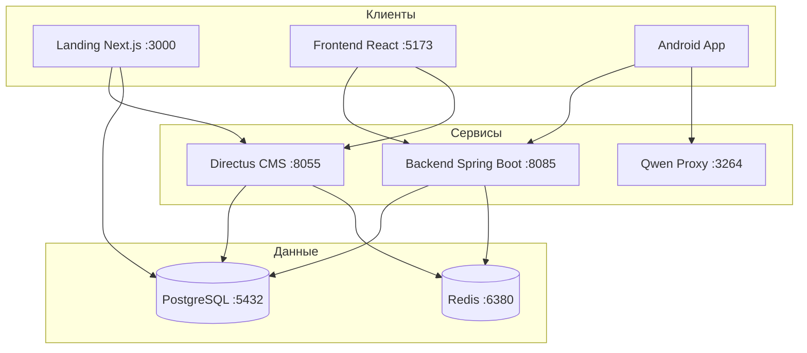

# Kursovaya — информационная система медицинской клиники

Монорепозиторий курсового проекта: веб-приложение (админка + API), публичный лендинг, мобильное Android-приложение, CMS и вспомогательные сервисы.

## Состав проекта

| Модуль | Путь | Технологии | Назначение |
|--------|------|------------|------------|
| **Backend API** | [`modules/backend`](modules/backend) | Java 21, Spring Boot 3, PostgreSQL, Redis | REST API, JWT, WebSocket, очередь приёмов, отчёты |
| **Frontend (админка)** | [`modules/frontend`](modules/frontend) | React 19, Vite, Redux Toolkit | Кабинеты администратора, врача, регистратуры |
| **Landing** | [`modules/landing`](modules/landing) | Next.js 16, Directus | Публичный сайт клиники (услуги, врачи, CMS) |
| **Mobile Android** | [`modules/mobile-android`](modules/mobile-android) | Kotlin, Android SDK | Мобильное приложение для пациентов |
| **DB Seeder** | [`modules/db-seeder`](modules/db-seeder) | Node.js, Faker | Наполнение БД тестовыми данными |
| **Qwen Proxy** | [`modules/qwen-proxy`](modules/qwen-proxy) | Node.js, Puppeteer | Прокси для ИИ-помощника (Qwen) |
| **Infra** | [`infra`](infra) | SQL, Docker | Схема БД, миграции, init-скрипты |

### Исторические репозитории

До объединения в монорепозиторий модули хранились отдельно:

- Backend: https://github.com/Zeit241/kursovaya_4_kurs_backend
- Frontend: https://github.com/Zeit241/kursovaya_4_kurs_frontend
- Landing: https://github.com/Zeit241/Kursovaya_3kurs_web
- Mobile: https://github.com/Zeit241/kursovaya_4_kurs_mobile

## Архитектура



## Быстрый старт (локально)

### Требования

- Docker и Docker Compose
- Java 21 (для backend)
- Node.js 18+ (frontend, landing, seeder)
- Android Studio (для мобильного приложения)

### 1. Инфраструктура

```bash
docker compose up -d db redis directus pgadmin
```

Сервисы после запуска:

| Сервис | URL |
|--------|-----|
| PostgreSQL | `localhost:5432` (login / pass, БД `clinic_db`) |
| Redis | `localhost:6380` |
| Directus | http://localhost:8055 |
| pgAdmin | http://localhost:8080 |

### 2. Backend

```bash
cd modules/backend
./mvnw spring-boot:run
```

API: http://localhost:8085 — документация эндпоинтов: [`modules/backend/API_ENDPOINTS.md`](modules/backend/API_ENDPOINTS.md)

> **Redis:** в Docker Redis проброшен на порт **6380**. Для локального запуска backend без Docker задайте `spring.data.redis.port=6380` или запустите Redis на 6379.

### 3. Frontend (админка)

```bash
cd modules/frontend
cp .env.example .env
npm install
npm run dev
```

Приложение: http://localhost:5173

### 4. Landing

```bash
cd modules/landing
cp .env.example .env.local
npm install
npm run dev
```

Сайт: http://localhost:3000

### 5. Наполнение БД (опционально)

```bash
cd modules/db-seeder
npm install
cp .env.example .env
npm start
```

### 6. Мобильное приложение

Откройте `modules/mobile-android` в Android Studio, скопируйте `local.properties.example` → `local.properties` и укажите URL backend и Directus token. Сборка: `./gradlew assembleDebug`.

### 7. ИИ-помощник (опционально)

```bash
cd modules/qwen-proxy
npm install
npm start
```

Прокси: http://localhost:3264

## Роли пользователей

- **patient** — запись на приём, просмотр истории, отзывы (мобильное приложение / web)
- **doctor** — расписание, очередь, приёмы, диагнозы
- **admin** — управление врачами, пациентами, услугами, отчёты

## Документация

- [Развёртывание на сервере](docs/DEPLOYMENT.md) — production-деплой с Docker, Nginx, systemd
- [Описание модулей](docs/MODULES.md) — подробности по каждому компоненту
- Backend API: [`modules/backend/API_ENDPOINTS.md`](modules/backend/API_ENDPOINTS.md)
- WebSocket: [`modules/backend/WEBSOCKET_API.md`](modules/backend/WEBSOCKET_API.md)
- Mobile API: [`modules/mobile-android/API.MD`](modules/mobile-android/API.MD)

## Структура репозитория

```
kursovaya/
├── docker-compose.yml      # Postgres, Redis, Directus, Landing, Qwen
├── infra/                  # SQL-схема и миграции
├── docs/                   # Документация
└── modules/
    ├── backend/            # Spring Boot API
    ├── frontend/           # React админка
    ├── landing/            # Next.js лендинг
    ├── mobile-android/     # Android-приложение
    ├── db-seeder/          # Seeder для PostgreSQL
    └── qwen-proxy/         # ИИ-прокси
```

## Лицензия

Курсовой проект. Все права принадлежат автору.
