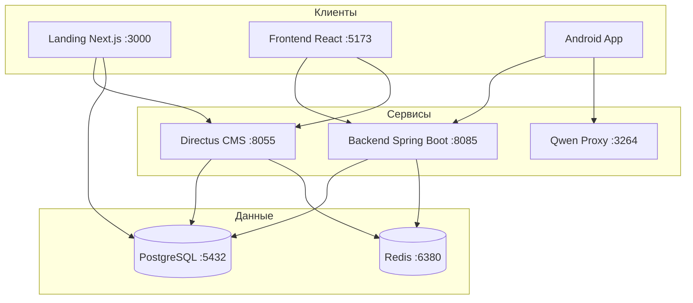

# Medisphere — информационная система медицинской клиники

Meta-репозиторий курсового проекта: инфраструктура, документация и **git submodules** на отдельные репозитории модулей (backend, frontend, landing, mobile).

## Состав проекта

| Модуль | Путь | Репозиторий | Ветка |
|--------|------|-------------|-------|
| **Backend API** | [`modules/backend`](modules/backend) | [kursovaya_4_kurs_backend](https://github.com/Zeit241/kursovaya_4_kurs_backend) | `master` |
| **Frontend (админка)** | [`modules/frontend`](modules/frontend) | [kursovaya_4_kurs_frontend](https://github.com/Zeit241/kursovaya_4_kurs_frontend) | `main` |
| **Landing** | [`modules/landing`](modules/landing) | [Kursovaya_3kurs_web](https://github.com/Zeit241/Kursovaya_3kurs_web) | `main` |
| **Mobile Android** | [`modules/mobile-android`](modules/mobile-android) | [kursovaya_4_kurs_mobile](https://github.com/Zeit241/kursovaya_4_kurs_mobile) | `master` |
| **DB Seeder** | [`modules/db-seeder`](modules/db-seeder) | в этом репозитории | `main` |
| **Qwen Proxy** | [`modules/qwen-proxy`](modules/qwen-proxy) | в этом репозитории | `main` |
| **Infra** | [`infra`](infra) | в этом репозитории | `main` |

| Модуль | Технологии | Назначение |
|--------|------------|------------|
| Backend | Java 21, Spring Boot 3, PostgreSQL, Redis | REST API, JWT, WebSocket, очередь, отчёты |
| Frontend | React 19, Vite, Redux Toolkit | Кабинеты администратора, врача, регистратуры |
| Landing | Next.js 16, Directus | Публичный сайт клиники |
| Mobile | Kotlin, Android SDK | Мобильное приложение для пациентов |
| DB Seeder | Node.js, Faker | Наполнение БД тестовыми данными |
| Qwen Proxy | Node.js, Puppeteer | Прокси для ИИ-помощника |
| Infra | SQL, Docker | Схема БД, миграции |

## Архитектура



## Клонирование

```bash
git clone --recurse-submodules https://github.com/Zeit241/Medisphere.git
cd Medisphere
```

Если уже склонировали без submodules:

```bash
git submodule update --init --recursive
```

### Обновление submodules

Подтянуть последние коммиты из репозиториев модулей:

```bash
git submodule update --remote --merge
```

Или по одному модулю:

```bash
cd modules/backend && git pull origin master
cd ../frontend && git pull origin main
```

После обновления submodules зафиксируйте новые SHA в meta-репозитории:

```bash
git add modules/backend modules/frontend modules/landing modules/mobile-android
git commit -m "chore: update submodules"
```

## Быстрый старт (локально)

### Требования

- Docker и Docker Compose
- Java 21 (для backend)
- Node.js 18+ (frontend, landing, seeder)
- Android Studio (для мобильного приложения)

### 1. Инфраструктура

```bash
docker compose up -d db redis directus pgadmin
```

Сервисы после запуска:

| Сервис | URL |
|--------|-----|
| PostgreSQL | `localhost:5432` (login / pass, БД `clinic_db`) |
| Redis | `localhost:6380` |
| Directus | http://localhost:8055 |
| pgAdmin | http://localhost:8080 |

### 2. Backend

```bash
cd modules/backend
./mvnw spring-boot:run
```

API: http://localhost:8085 — документация эндпоинтов: [`modules/backend/API_ENDPOINTS.md`](modules/backend/API_ENDPOINTS.md)

> **Redis:** в Docker Redis проброшен на порт **6380**. Для локального запуска backend без Docker задайте `spring.data.redis.port=6380` или запустите Redis на 6379.

### 3. Frontend (админка)

```bash
cd modules/frontend
cp .env.example .env
npm install
npm run dev
```

Приложение: http://localhost:5173

### 4. Landing

```bash
cd modules/landing
cp .env.example .env.local
npm install
npm run dev
```

Сайт: http://localhost:3000

### 5. Наполнение БД (опционально)

```bash
cd modules/db-seeder
npm install
cp .env.example .env
npm start
```

### 6. Мобильное приложение

Откройте `modules/mobile-android` в Android Studio, скопируйте `local.properties.example` → `local.properties` и укажите URL backend и Directus token. Сборка: `./gradlew assembleDebug`.

### 7. ИИ-помощник (опционально)

```bash
cd modules/qwen-proxy
npm install
npm start
```

Прокси: http://localhost:3264

## Роли пользователей

- **patient** — запись на приём, просмотр истории, отзывы (мобильное приложение / web)
- **doctor** — расписание, очередь, приёмы, диагнозы
- **admin** — управление врачами, пациентами, услугами, отчёты

## Документация

- [Развёртывание на сервере](docs/DEPLOYMENT.md) — production-деплой с Docker, Nginx, systemd
- [Описание модулей](docs/MODULES.md) — подробности по каждому компоненту
- Backend API: [`modules/backend/API_ENDPOINTS.md`](modules/backend/API_ENDPOINTS.md)
- WebSocket: [`modules/backend/WEBSOCKET_API.md`](modules/backend/WEBSOCKET_API.md)
- Mobile API: [`modules/mobile-android/API.MD`](modules/mobile-android/API.MD)

## Структура репозитория

```
Medisphere/
├── .gitmodules             # Ссылки на submodules
├── docker-compose.yml      # Postgres, Redis, Directus, Landing, Qwen
├── infra/                  # SQL-схема и миграции (в этом репо)
├── docs/                   # Документация (в этом репо)
└── modules/
    ├── backend/            # submodule → kursovaya_4_kurs_backend
    ├── frontend/           # submodule → kursovaya_4_kurs_frontend
    ├── landing/            # submodule → Kursovaya_3kurs_web
    ├── mobile-android/     # submodule → kursovaya_4_kurs_mobile
    ├── db-seeder/          # в этом репо
    └── qwen-proxy/         # в этом репо
```

## Лицензия

Курсовой проект. Все права принадлежат автору.
